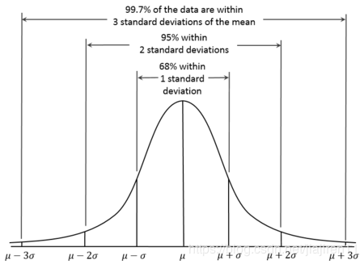

## 001 异常检测算法综述
&emsp;&emsp; 异常检测算法相关的资料 

&emsp;&emsp;`异常点检测（Outlier Detection）`，又称为`离群点检测`是找出其行为很不同于预期对象的一个检测过程。这些对象被称为异常点或者离群点。异常点检测在很多实际的生产生活中都有着具体的应用，比如信用卡欺诈，工业损毁检测，图像检测等。 

&emsp;&emsp;常见的`异常值检测模型`包括： 

   - 基于统计的模型: 
   - 基于距离的模型: 
   - 线性变换的模型: 

&emsp;&emsp;`异常点检测`和`聚类分析`的对比:服务于不同的目的。 

   - 聚类分析目的是：`发现数据集中的各种模式` 
   - 异常点检测目的是：`捕捉那些显著偏离多数模式的异常情况` 

### 001 定义:
&emsp;&emsp;异常值检测的定义：`Outlier detection` refers to the problem of finding patterns in data that `do not conform to expected behavior`. 
&emsp;&emsp;离群点检测的定义(`Outlier Mining Problems`):Given a set of n data points or objects and `k,the expected number outliers` , find `the top k objects` that are considerably `dissimilar,exceptional , or inconsistent` with repect to the remaining data. 
&emsp;&emsp;异常检测的应用： 

   - 侵入检测(`Intrusion Detection`)：适用于发现计算机相关系统的侵入行为等 
      - 基于主机的侵入检测(`Host Based Intrusion Detection System`) 
      - 网络侵入检测(`Network Intrusion Detection System`) 
   - 欺骗检测(`Fraud Detection`)： 
      - 信用卡(`credit card`) 
      - 手机(`mobile phone`) 
      - 保险索赔(`insurance claim`) 
   - 医疗及公共健康异常检测(`Medical and public health anomaly detection`)： 
   - 工业损毁检测(`Industrial damage detection`)： 
      - 机械装置的故障检测(` Fault Detection in Mechanical Units`) 
      - 结构缺陷检测(` Structural Defect Detection`) 
   - 图像处理(`Image procesing`)： 

### 002 异常检测算法的输出：(`Outlier Detection Algorithms Output`):
   - 第一类是:得到数据点“差异性”水平的`得分`:依据数据点的异常倾向进行排序 
   - 第二类是:得到可以表征数据点是否是异常的`二进制标签（0 or 1）`:一些算法可能直接返回二进制标签值，另外异常得分同样也可以转换成二进制标签值 

### 003 基于统计的模型:(`Statistical Models`)
#### 1. 一维异常检测：`(3σ - Rule)`
&emsp;&emsp;给定一个一维数据集合X = {x  1 ,x  2 ,..,x  n  },如果X满足高斯分布,那么通过极大似然估计方法，高斯分布的参数是： 

   - 均值( μ )= ( ∑ x  i   ) / n 
   - 方差 ( σ2 ) = ( ∑ (x  i > - μ ）2 ) / n  
   - 3σ - Rule ：如果一个新数据点 x ∉ （ μ - 3σ , μ + 3σ ）,则该数据点 x 可以被归类为异常点。 

&emsp;&emsp;在统计上，`68–95–99.7原则`是在正态分布中，距平均值小于`一个标准差`、`二个标准差`、`三个标准差`以内的百分比，更精确的数字是`68.27%、95.45%及99.73%`。若用数学用语表示，其算式如下，其中X为正态分布（也称为高斯分布）随机变数的观测值，μ为分布的平均值，而σ为标准差： 

   - P( μ - σ  <= X <= μ + σ  ) ≈ 0.6827  
   - P( μ - 2σ <= X <= μ + 2σ ) ≈ 0.9545  
   - P( μ - 3σ <= X <= μ + 3σ ) ≈ 0.9973  
   -   

&emsp;&emsp;在实验科学中有对应`正态分布`的`三西格马定律（three-sigma rule of thumb）`，是一个简单的推论，内容是“几乎所有”的值都在平均值正负三个标准差的范围内，也就是在实验上可以将99.7%的机率视为“几乎一定”。不过上述推论是否有效，会视探讨领域中“显著”的定义而定，在不同领域，“显著”（significant）的定义也随着不同，例如在社会科学中，若置信区间是在正负二个标准差（95%）的范围，即可视为显著。但是在粒子物理中，若是发现（英语：Discovery (observation)）新的粒子，置信区间要到正负五个标准差（99.99994%）的程度。 
&emsp;&emsp;在`不是正态分布`的情形下，也有另一个对应的三西格马定律（three-sigma rule），即使是在非正态分布的情形下，至少会有`88.8%的机率会在正负三个标准差的范围内`，这是依照`切比雪夫不等式`的结果。若是单模分布（unimodal distributions）下，正负三个标准差内的机率至少有95%，若一些符合特定条件的分布，机率至少会到98% 。 

##### 扩展研究：
   - Metis： 一个开源的对时间序列数据异常检测的一个工具 

#### 2. 一维异常检测：`(Grubb's test)`
&emsp;&emsp;格拉布斯的测试,用于检测`单变量数据集中的单个异常值`，该单变量数据集遵循近似正态分布。 
&emsp;&emsp;格拉布斯的测试也称为`最大标准残差测试`。实际上，Grubbs' Test可理解为`检验最大值、最小值偏离均值的程度`是否为异常。如果怀疑可能存在`多个异常值`，建议使用`Tietjen-Moore测试`或`广义极端学生化偏差测试`而不是Grubbs测试。 
&emsp;&emsp;对每一个实例 x i ，对应的` z - score `被定义为：z = | x  i  - μ | / s ， 其中 μ 表示数据集的均值 ， s表示 数据集的标准差。 

&emsp;&emsp;Grubb's test异常检测的条件：  

   -   
   - N表示数据集合的大小 
   - t  α /（2N），N-2 用来表示实例是否为异常或者正常的阈值。这个阈值取值于t分布的的 α /（ 2N ）显着性水平。 

#### 3. 多维异常检测：`马氏距离(Mahalanobis Distance)`
&emsp;&emsp;马氏距离(Mahalanobis Distance)是度量学习中一种常用的距离指标，同欧氏距离、曼哈顿距离、汉明距离等一样被用作评定数据之间的相似度指标。但却可以应对高维线性分布的数据中各维度间非独立同分布的问题。 
   - 单个数据点的马氏距离：DM(x,μ) = √((x-μ)T ∑-1(x-μ)) 
   - 数据点x,y的马氏距离：DM(x,y) = √((x-y)T ∑-1(x-y)) 
   - 其中Σ是多维随机变量的协方差矩阵，μ为样本均值，如果协方差矩阵是单位向量，也就是各维度独立同分布，马氏距离就变成了欧氏距离。 
&emsp;&emsp;由于所有在数据集合DM(x,μ)中的元素都是实数，因此单变量的Grubb's test 可以被应用到DM(x,μ)中，从而判断出实例x的 异常 与否 
&emsp;&emsp;DM(x,μ) 同样可以表示X 中x的异常得分  

#### 4. 多维异常检测：`卡方检验(x2 Statistic)`
&emsp;&emsp;卡方检验是一种检验两个变量独立性的方法。卡方检验最基本的思想就是通过`观察实际值与理论值的偏差`来确定理论的正确与否。具体做的时候常常先假设两个变量确实是独立的（行话就叫做“原假设”），然后观察实际值（也可以叫做观察值）与理论值（这个理论值是指“如果两者确实独立”的情况下应该有的值）的偏差程度，如果偏差足够小，我们就认为误差是很自然的样本误差，是测量手段不够精确导致或者偶然发生的，两者确确实实是独立的，此时就接受原假设；如果偏差大到一定程度，使得这样的误差不太可能是偶然产生或者测量不精确所致，我们就认为两者实际上是相关的，即否定原假设，而接受备择假设。 

