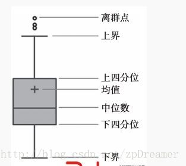

## 01 箱型图（Box plot）
&emsp;&emsp;箱型图（英文：Box plot），又称为盒须图、盒式图、盒状图或箱线图，是一种用作显示一组数据分散情况资料的统计图。因型状如箱子而得名。在各种领域也经常被使用，常见于品质管理，快速识别异常值。 
&emsp;&emsp;箱型图最大的优点就是不受异常值的影响，能够准确稳定地描绘出数据的离散分布情况，同时也利于数据的清洗。 
&emsp;&emsp;箱型图异常值通常被定义为：小于下限，或者大于上限 ，其中上限=min（Q3+1.5IQR，max）,下限=max（Q1-1.5IQR ，min),Q1是下四分位，Q3是上四分位，IQR（四分位距）=Q3-Q1，如下图： 
   - 

[<<5分钟包你搞懂箱形图分析！>>](http://www.sohu.com/a/220236877_434937) 
[<<箱形图（python画箱线图>>](https://blog.csdn.net/aijiudu/article/details/89387328)